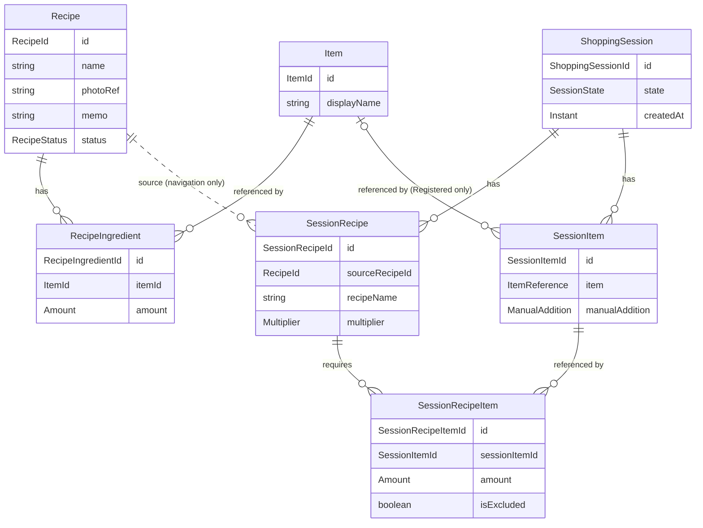

# Recipe-Deck アーキテクチャ

このファイルは Recipe-Deck の設計・技術構成の正本です。
仕様については [spec.md](spec.md) を参照してください。
設計に関わる変更をした PR では、このファイルも同じ PR で更新します。

## 技術構成

確定事項：

- Compose Multiplatform・Kotlin Multiplatform・Ktor を採用する
- マルチモジュール構成
- アーキテクチャは DDD の設計思想を取り入れた、クリーンアーキテクチャに基づく MVVM パターン

未確定：

- Room KMP・Metro・Ktor Client などのライブラリ選定
- Ktor サーバーの役割（重複判定のモデルをサーバーで推論する案がある。[AI / ML](#ai--ml)）

## モジュール構成

| モジュール | 内容 |
|---|---|
| `:app` | Android アプリ。現状は Android Studio の雛形のままで、`:shared:domain` には依存していない。CMP の構成への移行は未着手 |
| `:shared:domain` | ドメイン層の KMP モジュール。ターゲットは JVM・iosArm64・iosSimulatorArm64。パッケージは `amount` / `item` / `recipe` / `shopping`。Repository の interface もここに置く |
| `:shared:usecase` | UseCase の KMP モジュール。`:shared:domain` に依存し、ターゲットも同じ |

`:shared:domain` と `:shared:usecase` の JVM ターゲットは 11 に固定している。
Gradle を JDK 25 で動作させている場合でも、Java 11 でビルドしている `:app` から利用できるようにするためである。

## ドメイン層の方針

- ドメイン層の型は、データ構造と不変条件（invariant）の保持に専念する。操作（メソッド）は UseCase 実装時に必要な分だけ追加する。先行して定義したドメイン型が UseCase の実装に伴い変化することは健全であるとみなす
- 不変条件は生成時（コンストラクタや `of`）に検査し、不正な状態を作れないようにする
- UI に伝達すべき想定内の失敗（入力値の不正など）は、ドメイン層ではなく UseCase の結果型（`:shared:usecase` に配置）で表現して返却する。Repository が返す失敗型は `:shared:domain` に配置する（詳細は「データ層の方針」参照）。失敗の分類方針は「UseCase の方針」に従う。なお、ドメイン層の `require` は事前検証漏れに対する最後の防衛線であり、そのメッセージによって処理を分岐させてはならない
- ID は文字列をラップする値クラス（value class）とする。内部には UUID 形式の文字列を格納する取り決めとし、型自体ではフォーマットの検証を行わない。ID の生成は UseCase 側で行う
- 集約が保持するコレクションは kotlinx-collections-immutable の `ImmutableList` で受け取る。外部から渡されたリストが後から変更され、不変条件が崩れるのを防ぐためである
- 日時には `kotlin.time.Instant` を使用する。現在時刻は UseCase 側から引数で渡し、ドメイン層内部では時刻取得を行わない
- 有無だけを表すものは nullable、それ以上の意味を持つ状態は sealed interface で表す
- ドメインのテストは、ドメインのルールを素直に確かめるものにとどめ、他層の責務をドメインのテストで検証しない

### Kotlin 2.2 による制約

- kotlinx-collections-immutable は 0.4.0 を使う。0.5 系は Kotlin 2.3 でビルドされており、Kotlin 2.2 の iOS ターゲットでは読み込めないため
- `kotlin.time.Instant` は Kotlin 2.2 では実験的 API のため、使うファイルごとに `@file:OptIn(ExperimentalTime::class)` を宣言する
- `kotlin.uuid.Uuid` も同じく実験的 API のため、使うファイルごとに `@file:OptIn(ExperimentalUuidApi::class)` を宣言する

Kotlin を 2.3 以降へアップデートする際に、これらの制約は見直しが可能である。

## ドメイン構造

[PR #1](https://github.com/kyo1941/recipe-deck/pull/1)・[PR #2](https://github.com/kyo1941/recipe-deck/pull/2) で `:shared:domain` に実装した構造。
Room のテーブル設計を確定する図ではない。

- 材料（RecipeIngredient）は、Recipe のコンテキストにおいて「対象の Item をどう使うか」を保持する中間モデル
- Session 内の材料（SessionRecipeItem）も、ShoppingSession のコンテキストにおいて同様の責務を担う。分量を保持するのは特別なスナップショット用途ではなく、Recipe 側の中間モデルと同様の自然な責務である
- 分量（`Amount`）は数量（`Quantity`）と入力形式（`QuantityNotation`）と省略可能な単位（`AmountUnit`）の組。材料は分量ごと省略できる
- Item の参照（`ItemReference`）は、登録済みの Item を指す（`Registered`）か、表示名しか分からない（`Unregistered`）かを表す Item ドメインの型。材料の入力（`IngredientInput`）と SessionItem が、これを共通して使う
- SessionItem は、Item を指すか、Session 限定の品目の表示名を持つ。Session 限定の品目は Item を作らず、Session と同じ寿命を持つ（[spec.md](spec.md#item)）
- 状態（`SessionState`）は `Active` と `Completed(completedAt)`。完了日時は完了した Session だけが持つ
- 手動追加は、SessionItem 内で省略可能（nullable）な `ManualAddition` として保持し、さらにその中に省略可能な分量を持たせる（2段階の nullable）。`ManualAddition` 自体が null であれば手動追加されていないことを示し、分量が null であれば「数量指定なしで手動追加された」ことを意味する
  - 単なる参照の有無だけでは、同一の Item が Recipe にも含まれている場合に手動追加分と区別できず、Recipe を除外した際に手動追加した行を残せなくなる
  - 3パターンの sealed interface で表現しようとすると「手動追加」という概念が型定義から失われ、手動追加に属性が追加された際に重複定義が生じる
- ManualSessionItem や RecipeSessionItem のように、由来ごとに型を増やさない
- 統合済みの買い物項目は永続化せず、表示のたびに集計する（[spec.md](spec.md#買い物リスト表示)）

### 集約と不変条件

- Recipe は集約ルート。材料の一覧を保持し、並び順はリストの順序に従う。材料の行 ID は Recipe 内で重複しない
- 材料の行 ID は、Recipe を編集するたびに振り直している。今は行 ID を参照するものがないため。行 ID を参照する機能を足すときは、入力に行 ID を持たせて保つ形に変える必要がある
- ShoppingSession は集約ルート。内部に SessionRecipe・SessionRecipeItem・SessionItem を保持する。Session 外部と関連を持つのは ItemId と元 Recipe の RecipeId のみとする
- 1つの Session 内において、同一 Item を参照する SessionItem は最大1件（一意）。同じ表示名の Session 限定の品目も最大1件
- Session 限定の品目の表示名は、空白だけにできない
- SessionRecipeItem が参照可能なのは、同一 Session 内の SessionItem に限る
- Recipe 由来の参照も手動追加の指定も存在しない SessionItem は保持しない（除外設定された材料行からの参照も有効な参照としてカウントする）
- SessionRecipe・SessionItem・SessionRecipeItem の ID は Session 全体で重複しない
- 完了日時は作成日時より過去であってはならない
- 「active な Session は最大1件」という不変条件は複数 Session にまたがる制約であるため、単一集約の境界内では担保できない。Repository より下の層（データ層）で保証する。UseCase は Session の ID を受け取らず、進行中の Session を探して使う

### 永続化との対応

永続化層において、材料は Recipe と Item の中間テーブルとして表現される。
所属する Recipe の ID と並び順の列は、ドメイン層の型には持たせずデータ層で付与する。
また、1つの Recipe に同一 Item の行が複数存在しうるため、中間テーブルの主キーは (Recipe ID, Item ID) ではなく行ごとの固有 ID とする。

## UseCase の方針

- 操作（アクション）ごとに1クラスを定義し、単一の `suspend operator fun invoke` を持たせる。画面構成の変更が UseCase に波及しないよう、画面単位でのクラス設計は行わない
- ViewModel の `viewModelScope` から呼び出す。CMP では iOS も共通コード上の ViewModel から呼び出すため、Android と同様の設計となる
- UseCase 内部ではディスパッチャ（スレッド）の切り替えを行わない。必要であれば Repository の実装側で切り替える
- 結果は UseCase ごとの sealed interface で返却する。ViewModel は例外を catch せず、結果を UiState に変換するだけにとどめる
  - 成功と失敗で階層を入れ子にせず、操作の結果として起きたことごとの型を、単一の sealed interface 直下に並べる（`Saved`・`NameRequired`・`RecipeNoLongerExists` など）。Repository の失敗は技術的要因による分類であり、UseCase の結果は操作として何が起きたかで分類するため、結果を `Outcome` ではラップしない
  - 型名は状況を表すものとし、画面側の振る舞いを指示する名前（`ShowNameError` など）にはしない。画面構成が変更されても UseCase に影響を与えないよう、結果に応じて何を行うかは ViewModel 側が決定する
  - UseCase が理由ごとの結果を用意していない失敗は、`Unexpected` として原因（cause）とともに返却する。個別の理由を持つ結果と区別できるよう、汎用の受け皿であることが名称から明確に伝わる命名とする
  - 結果を表す型定義は、UseCase と同一ファイルに配置する
  - UI 側で事前バリデーションを行っている場合でも、UseCase 側でも二重に検証し、違反時は失敗結果として返却する
  - 失敗の種別は、実際に発生しうる実装段階になってから追加する。例えばネットワーク起因の失敗は、サーバー同期機能を実装する段階で追加する
- Repository の失敗のうち、どれを個別に処理し、どれを同一視し、どれを汎用の `Unexpected` にまとめるかの判断は UseCase が担う。失敗型の変換処理を行う `when` 式では `else` 分岐を使用せず、Repository の失敗種別が増加した際にコンパイルエラーで検知できるようにする
- コルーチンのキャンセル（`CancellationException`）は UseCase 内で捕捉・ハンドリングしない
- 名前やメモの前後の空白除去（トリム）や、空白文字のみのメモを未設定（`null`）へ変換するといった、入力値の正規化処理は UseCase 側で行う
- 「下書き」や「利用可能」といったユーザーの選択値は、UI 層からの引数として受け取る
- 入力フォームの都合から来るルール（表示名も分量もない材料は無視する、など）は、UseCase の入力の型（`IngredientInput`）に持たせ、UseCase の中で条件式として書かない。製品全体で一貫するルール（数量がなければ分量なし）は domain（`Amount.ofOrNull`）に置く
  - `IngredientInput` は、Recipe の作成・編集と、Session への Recipe の追加で共通して使う
- 1つのトランザクションでは、1つの集約だけを変更することを原則とする。Recipe の作成・編集は例外で、材料の入力と同時に新しい Item を作るという UI の都合から、新しい Item と Recipe を `TransactionRunner` で1つのトランザクションにまとめる。集約の境界は変えない（Item は複数の Recipe や Session から共有され、寿命も Recipe と異なるため）
  - 取り消すかどうかは、使う側が `TransactionScope.rollback` で指示する。Repository は失敗を例外ではなく `Outcome.Failure` で返すため、`TransactionRunner` が結果を見て自動で取り消すことはしない
  - 保存は Item を先、Recipe を後にする。仮に同じトランザクションにできなくても、失敗して残るのは単独の Item だけになり、存在しない Item を参照する Recipe は残らない
- Session への Recipe の追加は、書き込みが Session の Repository への1回だけなので、`TransactionRunner` を使わない。Session 内の複数のテーブルへの書き込みは、Repository の実装の中でデータベースのトランザクションにまとめる

## データ層の方針

- Repository の interface は `:shared:domain` に配置し、UseCase はその interface のみに依存する。具体的な実装クラスはデータ永続化方式を決定する段階で作成する
- ローカルストレージとサーバーのどちらからデータを読み取るかを抽象化・切り替える層（Gateway）は、2系統目のデータソース（サーバー同期機能など）が実際に必要になった段階で導入する
- Web 版はオンライン専用を想定しており、ローカル保存を行わずサーバー上のデータを直接扱う。そのため、Repository の具象実装はプラットフォームごとに異なる可能性がある
- Repository の戻り値には、domain 層で定義した `Outcome<T, E>`（`Success` および `Failure`）を使用する。標準の `kotlin.Result` では失敗型が `Throwable` に固定されて `when` 式での網羅性検査が効かないため、型パラメータで失敗の型を指定できる独自の型を用意している。なお、`kotlin.Result` との名前の衝突を避けるため `Outcome` と命名している
- Repository 起因の失敗は、Repository ごとに定義した sealed interface（例: `RecipeRepositoryFailure`）で表現する。これは技術的要因に基づく分類であり、UI 層の関心事とは完全に分離されている。失敗の種類を追加した際には、それを受け取る UseCase 側の `when` 式がコンパイルエラーとなるため、処理の考慮漏れを防止できる。今は Repository ごとに1つの型とし、メソッドによって発生しうる失敗の種類がずれてきたら、メソッドごとに型を分ける
- データ層の実装では、利用する外部ライブラリから送出される例外を捕捉し、このドメイン失敗型にマッピングして返却する。これにより、UseCase 層が特定のライブラリに依存することを防ぐ
- データ層の実装では、コルーチンの `CancellationException` を失敗型でラップせず、そのまま再送出（throw）する。失敗型にラップしてしまうと、全 UseCase 側でキャンセルの有無を個別に識別しなければならなくなるためである
- `TransactionRunner` は、Room KMP の `useWriterConnection { it.immediateTransaction { … } }` で包み、`TransactionScope.rollback` を Room の `TransactionScope.rollback` へ渡す想定である。その中で Repository の実装が呼ぶ DAO が同じトランザクションに入るかは、公式ドキュメントで明記を確認できていないため、データ層の実装時に動かして確かめる。技術的に難しい場合は、トランザクションの境界とデータ層の実装を再検討する

## 実装の進め方

トップダウンで、次の順序で進める。

1. Item
2. Recipe
3. RecipeIngredient
4. Recipe 作成・編集 UseCase
5. Item 作成・選択 UseCase
6. ShoppingSession
7. SessionRecipe
8. SessionItem
9. SessionRecipeItem
10. Recipe → ShoppingSession 追加 UseCase
11. 買い物リストの集計
12. 購入済みチェックの操作
13. Item 重複候補判定を UseCase へ接続
14. rename / merge を必要な範囲で追加
15. Room や UI の詳細を実装に合わせて確定

1〜3 および 6〜9 は、ドメイン層の型として実装済み。
4 は、名前・状態・材料を指定して Recipe を作成する UseCase、および名前・状態・メモ・材料を編集する UseCase を実装済み。
編集内容は保存ボタンの押下時に一括で反映する設計としている。
材料は、材料ごとに「既存の Item ID」か「新しい表示名」と、分量を受け取る。
新しい表示名の Item は Recipe の保存時に一緒に保存し、Item 作成 UseCase は呼ばずに `ItemRepository` を直接使う。
後から「Item だけを先に保存するボタン」を設ける場合は、Recipe がなく Item だけがある状態が認められているため、そのボタンを Item 作成 UseCase に繋げばよい。
材料を Item に結び付ける処理（`resolveIngredients`）は、作成と編集で共通にしている。
表示名を既存の Item と照らす処理（`linkToExistingItem`）は、Session への Recipe の追加とも共通にしている。
写真も同一の UseCase に含める想定であるが、実際に統合するかどうかは写真機能の実装時に決定する。
なお、写真機能をどの段階で実装するかは現時点では未定である（詳細は [photo.md](photo.md) 参照）。

5 は、既存の Item を表示名の部分一致で探す UseCase と、Item を作成する UseCase を実装済み。
Item 作成 UseCase は、重複候補をいつユーザーに見せるか（入力中か保存時か）という UI の作りとは切り離して作っている。
AI による重複候補判定（13）は後から差し込む。
差し込む場所によっては、結果の種類に加えて、ユーザーが候補を確認したうえで新規作成を選んだことを伝える引数も増える。

10 は、Recipe を進行中の Session に追加する UseCase を実装済み。
進行中の Session がなければ作り、下書きの Recipe は拒む。
入力は、Recipe ID と倍率、および追加の画面に出ている最終形の材料の一覧（倍率を掛け、量の変更・除外・今回だけの材料の追加を終えたもの）とする。
材料の一覧は `IngredientInput` に除外の有無を加えた形で受け取る。
倍率の計算はこの UseCase の外（追加の画面に出す分量を作るところ）で行い、UseCase は倍率を記録として残すだけである。
倍率の計算で桁あふれした場合は予期しない失敗として扱う。計算をどこに置くか（UI か、表示用の分量を作る UseCase か）は、画面を作るときに決める。
追加のたびに Session 内の Recipe を1つ作り、同じ品目の SessionItem は使い回す。

## AI / ML

PoC は完了済み。
現時点の参考：

- 候補検索は ruri-v3-30m int8 + cosine Top-K が有力
- 候補検索の用途では 30m モデルによる埋め込みが有効である
- 強い Item 同一性の判定（同じ Item かどうかの判定）においては、埋め込みを足しても利得は限定的である
- 厳密な安全性側に倒すほど、SAME（同一判定）の再現率（Recall）が大幅に低下する
- 同音異義のハードネガティブ（紛らわしい負例）を増やすと、誤検出（False Positive）には強くなるが、検出すべき候補の取りこぼし（False Negative）が増加する
- reranker（再ランク付けモデル）の導入については、MVP に採用するほどの十分な精度改善が見られていない
- silent merge（暗黙的な統合）を行わない UX 設計であれば、候補提示の誤りと自動統合による誤りは分けて考える

ただし：

- 実機環境での推論速度、メモリ消費、アプリサイズへの影響は MVP の実装時に検証する
- Android における読み仮名変換の方式は未確定
- 端末上でのオンデバイス推論が困難な場合、同一の自前モデルを Ktor サーバー側で推論させる代替案がある
- Jev などの外部判定モデルの採用は保留
- AI の方式によってドメインモデルを変更しない

## 未確定事項

実装開始前にすべてを確定させるのではなく、UseCase を順次実装していく中で具体的に必要性が生じた段階で相談・決定する。

- Repository の分け方
- ローカルの保存方式（Room KMP など）と、プラットフォームごとの Repository の実装
- Room のテーブル・主キー・インデックス
- 購入済みチェック状態の永続化・保持方法（SavedStateHandle、Room の別の場所など）。KMP / CMP / iOS における挙動も調査した上で決定する。なお、Android の SavedStateHandle は、ユーザーによるアプリ終了や端末の再起動によって破棄される
- Recipe の写真に関する未決定事項（詳細は [photo.md](photo.md) 参照）
- Recipe 削除機能の実装時、編集画面からの保存によって削除済み Recipe を再作成しないようにするか。現時点では決めていない。今の実装は新規作成と同一の `save` メソッドで上書き保存する構成となっている
- 変更がない状態での保存要求時にも永続化処理を行うかどうか。現時点では無条件で保存する実装となっており、将来のサーバー同期導入時に方針を決定する
- Item の表示名の一致判定（検索の部分一致、作成時の重複検知の完全一致）をどこで行うか。現時点では、どちらも Repository から全件を読み込み、UseCase で絞り込んでいる。Recipe の作成・編集と Session への Recipe の追加の UseCase も、材料の新しい表示名を既存の Item と照らすために、Item を全件読み込んでいる。表示名の一致の規則（何を同じ名前とみなすか）を domain に置くかも、あわせて決める。データ層の実装時に、表示名を Repository へ渡す形へ移すかを、検索と作成で揃えて決める。Web 版では全件の通信が重くなること、SQLite の `LIKE` は英字の大文字・小文字を区別せず `%` や `_` のエスケープも必要なことを踏まえる。移した場合も、入力の正規化と空入力の扱いは UseCase に残す。あわせて、同じ表示名の Item の作成が同時に行われた場合の重複を、データ層でどう防ぐかも決める（Room の `@Transaction` で足りるか、一意制約が要るかなど）
- Recipe の保存時や Session への Recipe の追加時に既存の Item を使ったことを、材料の行単位で返す必要があるか。現時点では、使った既存の Item の一覧だけを返している。UI の実装時に確認する
- domain の不変条件の守り方。今は生成時に `require` で例外を投げているが、クラッシュを防ぐため、生成時に null（理由を区別したい場合は sealed interface の失敗型）を返す形に置き換える方針とし、次の作業で行う。UI から呼ばれうる `Quantity.of` や、桁あふれで例外を投げる `Quantity` の計算も対象に含める。Arrow などのライブラリは今は使わない。値をデフォルト値に吸収するのは、その値の意味が仕様で決まっている場合（空白だけのメモをメモなしとする、など）に限る。想定外のデータ（保存先から読み戻した値が不変条件を満たさない、など）のログはデータ層で残す。ログの仕組みはデータ層の実装時に決める
- 同じ端末で Session への追加が同時に走った場合（連打など）の扱い。UseCase は進行中の Session を読んでから保存するため、片方の追加が失われるか、データ層の一意制約で失敗しうる。データ層の実装時に決める
- UseCase の結果を画面向けに変換する層を設けるか（Presentation の層を挟むか、ViewModel が直接扱うか）。UI の実装時に決める
- 別名（alias）の具体的な永続化構造
- SAME / NOT_SAME 判定に対するフィードバックの保存形式
- AI 用の interface の名前と、機能フラグ（feature flag）の構造
- ML の判定閾値（しきい値）
- Android プラットフォームにおける読み仮名変換の実装方式
