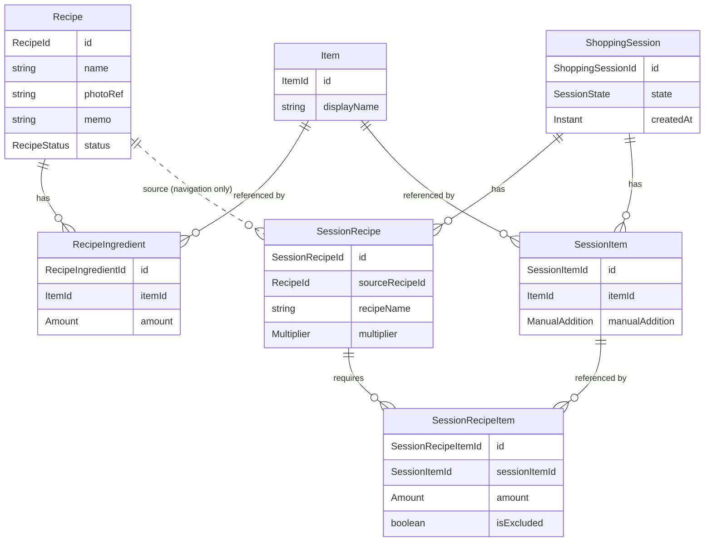

# Recipe-Deck アーキテクチャ

このファイルは Recipe-Deck の設計・技術構成の正本です。
仕様は [spec.md](spec.md) にあります。
設計に関わる変更をした PR では、このファイルも同じ PR で更新します。

## 技術構成

確定事項：

- Compose Multiplatform・Kotlin Multiplatform・Ktor を採用する
- マルチモジュール構成
- アーキテクチャは DDD を取り入れた、クリーンアーキテクチャベースの MVVM

未確定：

- Room KMP・Metro・Ktor Client などのライブラリ選定
- Ktor サーバーの役割（重複判定のモデルをサーバーで推論する案がある。[AI / ML](#ai--ml)）

## モジュール構成

| モジュール | 内容 |
|---|---|
| `:app` | Android アプリ。現状は Android Studio の雛形のままで、`:shared:domain` には依存していない。CMP の構成への移行は未着手 |
| `:shared:domain` | ドメイン層の KMP モジュール。ターゲットは JVM・iosArm64・iosSimulatorArm64。パッケージは `amount` / `item` / `recipe` / `shopping` |

`:shared:domain` の JVM 出力は 11 に固定している。
Gradle を JDK 25 で動かしても、Java 11 でビルドしている `:app` から使えるようにするため。

## ドメイン層の方針

- ドメインの型は、型と不変条件だけを持つ。操作は UseCase を作るときに必要な分だけ足す。先に決めたドメインが UseCase で変わるのは健全とみなす
- 不変条件は生成時（コンストラクタや `of`）に検査し、不正な状態を作れないようにする
- 想定内の失敗（入力不正など）は、検査ごとではなく製品上の意味が変わる単位で型（sealed interface）にまとめ、UseCase の戻り値として返す。ドメインの `require` は検査漏れに対する最後の防衛線で、そのメッセージで処理を分けない
- ID は文字列を包む値クラス。中身は UUID 文字列で、生成は UseCase 側で行う
- 集約が持つ一覧は kotlinx-collections-immutable の `ImmutableList` で受け取る。渡した一覧を後から書き換えて不変条件を崩せないようにするため
- 日時は `kotlin.time.Instant`。現在時刻は UseCase から渡し、ドメインの中では取得しない
- 有無だけを表すものは nullable、それ以上の意味を持つ状態は sealed interface で表す
- ドメインのテストは、ドメインのルールを素直に確かめるものにとどめる。他の層の責務はドメインのテストで検証しない

### Kotlin 2.2 による制約

- kotlinx-collections-immutable は 0.4.0 を使う。0.5 系は Kotlin 2.3 でビルドされていて、Kotlin 2.2 の iOS ターゲットでは読み込めないため
- `kotlin.time.Instant` は Kotlin 2.2 では実験的 API のため、使うファイルごとに `@file:OptIn(ExperimentalTime::class)` を宣言する

Kotlin を 2.3 以降に上げるときに、この2点は見直せる。

## ドメイン構造

[PR #1](https://github.com/kyo1941/recipe-deck/pull/1)・[PR #2](https://github.com/kyo1941/recipe-deck/pull/2) で `:shared:domain` に実装した構造。
Room のテーブル設計を確定する図ではない。

- 材料（RecipeIngredient）は、Recipe の世界で「この Item をどう使うか」を持つ中間モデル
- Session 内の材料（SessionRecipeItem）は、ShoppingSession の世界で同じ種類の責務を持つ。分量を持つのは特別なスナップショットのためではなく、Recipe 側の中間モデルと同じ自然な責務
- 分量（`Amount`）は数量（`Quantity`）と省略可能な単位（`AmountUnit`）の組。材料は分量ごと省略できる
- 状態（`SessionState`）は `Active` と `Completed(completedAt)`。完了日時は完了した Session だけが持つ
- 手動追加は、SessionItem の省略可能な `ManualAddition` で表し、その中に省略可能な分量を持つ（2段の nullable）。手動追加が無ければ手で足していない、分量が無ければ数量なしで手で足した、という意味
  - 参照の有無だけでは、同じ Item が Recipe 由来でもあるときに手で足したかを区別できず、Recipe を外したときに手で足した行を残せない
  - 3パターンの sealed interface にすると「手動追加」という概念が型から消え、手動追加に属性が増えたときに重複して書くことになる
- ManualSessionItem や RecipeSessionItem のように、由来ごとに型を増やさない
- 統合済みの買い物項目は永続化せず、表示のたびに集計する（[spec.md](spec.md#買い物リスト表示)）

### 集約と不変条件

- Recipe は集約ルート。材料の一覧を持ち、並び順は一覧の順。材料の行 ID は Recipe 内で重複しない
- ShoppingSession は集約ルート。SessionRecipe・SessionRecipeItem・SessionItem をその中に持つ。Session の外とつながるのは ItemId と元 Recipe の RecipeId だけ
- 1つの Session に、同じ Item の SessionItem は1つだけ
- SessionRecipeItem が参照できるのは、同じ Session 内の SessionItem だけ
- Recipe 由来でも手動追加でもない SessionItem は残さない（除外した材料行からの参照も数える）
- SessionRecipe・SessionItem・SessionRecipeItem の ID は Session 全体で重複しない
- 完了日時は作成日時より前にならない
- 「active な Session は最大1件」は複数の Session にまたがるため、1つの集約の中では守れない

### 永続化との対応

材料は、永続化では Recipe と Item の中間テーブルになる。
所属する Recipe の ID と並び順の列は、ドメインの型には持たせず data 層で付ける。
主キーは (Recipe ID, Item ID) ではなく行の ID。
1つの Recipe に同じ Item の行が複数ありうるため。

## 実装の進め方

トップダウンで、次の順に進める。

1. Item
2. Recipe
3. RecipeIngredient
4. Recipe 作成・編集 UseCase
5. Item 作成・選択 UseCase
6. ShoppingSession
7. SessionRecipe
8. SessionItem
9. SessionRecipeItem
10. Recipe → ShoppingSession 追加 UseCase
11. 買い物リストの集計
12. 購入済みチェックの操作
13. Item 重複候補判定を UseCase へ接続
14. rename / merge を必要な範囲で追加
15. Room や UI の詳細を実装に合わせて確定

1〜3 と 6〜9 は、ドメインの型として実装済み。

## AI / ML

PoC は完了済み。
現時点の参考：

- 候補検索は ruri-v3-30m int8 + cosine Top-K が有力
- 30m の埋め込みは候補検索の用途では価値がある
- 強い Item 同一性の判定では、埋め込みを足しても利得は限られる
- 厳密な安全性に倒すほど SAME の再現率が大きく下がる
- 同音異義のハードネガティブを増やすと誤検出には強くなるが、取り逃しが増える
- reranker は MVP での採用を正当化する改善を示していない
- silent merge をしない UX なら、提案の誤りと自動統合の誤りは分けて考える

ただし：

- 実機での速度、メモリ、アプリサイズは MVP の実装時に確認する
- Android での読み変換の方式は未確定
- 端末上での推論が厳しければ、同じ自前モデルを Ktor サーバーで推論する選択肢がある
- Jev などの外部の判定モデルは保留
- AI の方式によってドメインモデルを変えない

## 未確定事項

実装前に全部は確定させない。
実際に UseCase を1つずつ実装し、必要性が見えた時点で相談する。

- Repository の分け方
- Room のテーブル・主キー・インデックス
- 購入済みチェックの保存方法（SavedStateHandle、Room の別の場所など）。KMP / CMP / iOS の挙動も調べて決める。Android の SavedStateHandle は、ユーザーによるアプリの終了や端末の再起動では消える
- 想定内の失敗の具体的な型
- alias の具体的な保存構造
- SAME / NOT_SAME のフィードバックの保存形式
- AI 用の interface 名・feature flag の構造
- ML の閾値
- Android での読み変換の実装
