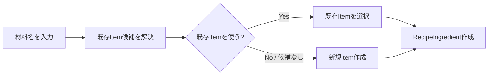
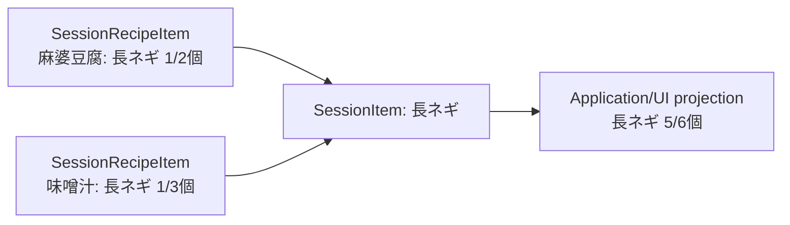
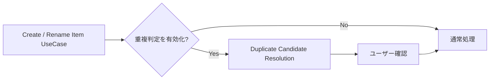

# Recipe-Deck MVP 仕様

このファイルは Recipe-Deck MVP の仕様の正本です。
設計・技術構成については [architecture.md](architecture.md) を参照してください。
Notion の要件ページや PoC ページと食い違う場合は、このファイルを優先します。
未確定事項を独断で補完せず、実装時に相談して決定します。
仕様に関わる変更をした PR では、このファイルも同じ PR で更新します。

> **過剰設計しないこと。**
> 将来起こり得る問題を先回りして、未要求の Entity・状態・Repository・履歴・分岐を追加しない。
> 将来の共有・同期・在庫・クラウド・undo などを理由に、不要な抽象化を追加しない。
> まず最小の自然なドメインを実装し、実際に必要になった責務だけ追加する。

## プロダクトの中核

Recipe-Deck は、個別の買い物 Item を直接並べることを主目的とせず、**「何を作るか／何のために買うか」を起点に買い物リストを作成するアプリ**です。

代表フロー：

1. Recipe「麻婆豆腐」を登録する
2. Recipe に豆腐・長ネギ・ひき肉などを登録する
3. Recipe を今回の ShoppingSession へ追加する
4. 必要な Item を買い物リストとして表示する
5. 店頭で購入済みチェックを行う

MVP ではユーザー自身が所有する Recipe を前提とし、公開・共有・EC 連携などは対象外とします。
アカウント機能、複数端末間での共有・同期、および Web 版は MVP 以降に対応予定です。
なお、Web 版はオンライン専用を想定しています。

## 用語

| 呼び方 | コード上の名前 | 意味 |
|---|---|---|
| Recipe | `Recipe` | ユーザーが再利用する「作るもの」 |
| 材料 | `RecipeIngredient` | Recipe で、ある Item をどれだけ使うか |
| Item | `Item` | 買い物対象の同一性（ひき肉、豆腐、長ネギ） |
| 分量 | `Amount` | 数量と入力形式と、省略可能な単位の組 |
| 数量 | `Quantity` | 正の有理数 |
| 入力形式 | `QuantityNotation` | 数量を分数と小数のどちらで入力したか |
| 単位 | `AmountUnit` | 個・g・kg・ml・L |
| 倍率 | `Multiplier` | Recipe を Session に追加する際の倍率 |
| 下書き／利用可能 | `RecipeStatus.DRAFT` / `READY` | Recipe の状態 |
| ShoppingSession | `ShoppingSession` | 「今回の買い物」 |
| 進行中／完了 | `SessionState.Active` / `Completed` | ShoppingSession の状態 |
| Session 内の Recipe | `SessionRecipe` | Session に追加した Recipe のコピー |
| Session 内の材料 | `SessionRecipeItem` | Session 内の Recipe が、ある Item をどれだけ必要とするか |
| Session 内の Item | `SessionItem` | Session 内の Item 1つ（買い物リストの1行の元） |
| 手動追加 | `ManualAddition` | Recipe を経由せず Session に直接追加した項目 |
| 今回は不要 | `SessionRecipeItem.isExcluded` | Recipe 本体は変更せず、今回に限り材料を除外すること |

## Recipe

ユーザーが再利用する「作るもの」です。

確定事項：

- 名前のみ必須（空白文字のみの名前は不可）
- 写真は任意
- メモは任意（説明欄は持たない）。空白文字のみのメモは、メモなし（null）として扱う
- 材料0件でも保存できる
- 人数（何人分か）の項目は持たない
- 状態は下書き（draft）／利用可能（ready）の2値。ユーザーが明示的に切り替えるものとし、材料数や写真の有無に基づく自動判定は行わない
- Recipe に登録された材料構成を1単位として扱う
- 同一の Item を1つの Recipe 内で複数行保持できる
- ShoppingSession へ追加する際に倍率を指定できる。倍率は正の有理数（1/4、1/2、1、2…）とし、選択肢は UI 側で提示・決定する
- Recipe を編集しても、既に ShoppingSession へ追加済みの内容は自動で変更されない

## Item

Recipe や ShoppingSession に所属しない、**買い物対象の同一性**を表す概念です。
例：ひき肉、豆腐、長ネギ。

確定事項：

- Item の同一性は内部 ID で表す
- 数量・単位・メモ・Recipe 内の並び順などは Item 本体に持たせない
- Recipe 由来か手動追加かで Item の種類を分けない
- Item の表示名変更（rename）と、異なる Item 同士の同一性統合（merge）は、別個の概念として扱う
- AI の導入有無にかかわらず、Item というドメイン概念は変更しない
- Session で手動追加したものも Item として作成する（ただし、Session 固有のデータは Session の外には持ち出さない）
- 前後の空白を除いた表示名が、登録済みの Item と完全に一致する場合は、新しい Item を作らない
  - Item を単独で作る操作では、同じ表示名の Item があることを返す
  - Recipe の保存時に、材料として入力した表示名が一致した場合は、確認を挟まずに既存の Item を使う。既存の Item を使ったことは結果で返し、ユーザーへ知らせるかどうかは UI が決める
  - 同じ保存の中で、同じ新しい表示名を複数の材料に入力した場合も、Item は1つだけ作り、それらの材料が共通して参照する
- 既存の Item は、表示名の部分一致で探す
- Item は、Recipe や Session から使われていなくても単独で存在してよい。一方で、Recipe が使っている Item だけが消えることは避けたい（Item と Recipe とで寿命が異なる）

## 分量

数量と入力形式と単位の組です。
材料（RecipeIngredient）と Session 内の材料（SessionRecipeItem）が持ちます。

確定事項：

- 数量は正の有理数（約分済みの分子・分母）。0 および負数は不可。1/3個のような端数を正確に保持し、合算や倍率計算で誤差を生じさせないため、小数値としては保持しない
- 数量の未指定は分量ごと省略して表す（0 として扱わない）
- 単位は「個」「g」「kg」「ml」「L」および「単位なし」。玉・束・本など対象物そのものを数える助数詞は「個」に統一する。ユーザー定義の単位は設けない
- パック・袋など容器を数える単位の扱いは未確定（[未確定事項](#未確定事項)）
- 数量なしで単位のみが存在する状態は許容しない。単位のみが入力された場合は分量なしとして扱う。このルールは分量（ドメイン）が持ち、入力を受け取る UseCase はそれを通して分量を作る
- 単位は入力された表記のまま保存し、自動換算は行わない（1000ml を自動で 1L に変換しない）
- 入力形式（分数表記か小数表記か）は、数値本体とは別の属性として保持する。値としては同じ 1/2 でも、ユーザーが「0.5」と入力したなら「0.5」と表示できるようにするため

## ShoppingSession

「今回の買い物」を表す単位です。

確定事項：

- 履歴として複数保持できる
- 通常の UI 操作において active な Session は最大1件
- 状態は active / completed の2種類。破棄する買い物リストは履歴として残さず削除する
- completed な Session は過去の買い物実績として扱い、Session へコピーした内容（Recipe 名・倍率・分量など）をそのまま保持する。Item は ItemId で参照するため、Item の表示名を固定（スナップショット化）するかどうかは未確定（[未確定事項](#未確定事項)）
- 進行中の Session では、Item の表示名変更（rename）が反映される（Session は Item を ItemId で参照しており、表示名自体は保持しないため）
- 作成日時と完了日時を保持する。完了日時を持つのは completed な Session のみ。作成日時は Session 作成時のタイムスタンプとする
- Recipe を Session へ追加した後は、元の Recipe が編集されても自動同期しない
- Session 内のデータは Session 完結とし、元の Recipe と密結合させない
- Session 内で完結した形で材料の追加・数量変更・「今回は不要」による除外が可能であり、Recipe 本体には反映されない。除外した材料も Session 内に保持され、再度有効化できる
- Session 内の Recipe に今回限りで追加した材料と、Recipe からコピーした材料は区別しない（いずれも Session 内の材料として保持する）。一方、Recipe を経由せず Session に直接追加した分は、手動追加（ManualAddition）として区別して保持する
- Session から Recipe 単位で削除できる。ただし買い物リスト表示の実装方式によっては不要になる可能性がある
- 追加後に倍率を変更する操作は MVP では提供しない
- 購入済みチェックはドメインモデルに持たせない（[購入済みチェック](#購入済みチェック)）

## 材料の Item 参照

**保存済みの材料（RecipeIngredient）は Item を必ず参照する。**
「Item 未確定の材料」というドメイン状態は MVP では作らない。

未確定なのは、テキスト入力中や候補選択中の **UI / アプリケーション上の一時状態**であり、永続的なドメイン状態ではない。

Recipe の作成・編集では、材料ごとに「既存の Item」か「新しい表示名」を受け取り、新しい表示名の Item は Recipe の保存時に一緒に保存する。
Recipe の保存に失敗した場合は、そのとき作った Item も残さない。

材料の入力は、次のように扱う。

- 表示名も分量もない材料は、追加しかけてやめたものとして無視し、残りを保存する。単位だけが入力された材料も、分量なしとなるため同じ扱いとする
- 表示名がなく、分量がある材料は不正とし、何も保存せずに該当する材料の位置を返す
- 表示名があり、分量がない材料は、分量なしの材料として保存する

## ShoppingSession への Recipe 追加

Recipe を Session へ追加するとき、Session 側へ必要な情報をコピーする。
**追加後は ShoppingSession 側で完結する**。

- 元の Recipe を編集しても既存の Session には影響しない
- Recipe が後から変更・削除されても、進行中 Session の整合性を損なわない
- Session へコピーするのは、Recipe 名・追加時の倍率・倍率適用後の分量
- Item は ItemId で参照し、表示名はコピーしない
- Session 内の材料は倍率適用後の分量を保持する。これにより、Session 内で数量を修正した際に、倍率適用前後のどちらの値を操作しているかが曖昧になるのを防ぐ
- 元の Recipe ID は Recipe 画面への画面遷移用途でのみ保持し、それ以外の目的で Recipe を参照しない
- Session 内での変更を Recipe 本体へ反映する機能の検討時に、データ設計と合わせて見直す

## 買い物リスト表示

**統合済みの買い物項目を永続化せず、Session 内の Item などから表示のたびに集計する。**

例：

- 麻婆豆腐 → 長ネギ 1/2個
- 味噌汁 → 長ネギ 1/3個
- 同じ Item へ解決されていれば、表示上は長ネギ 5/6個

理由：

- 元のデータを正として扱える
- 二重管理を避けられる
- Item の統合や表示仕様の変更に追従しやすい
- MVP の規模であれば、表示ごとの集計でもパフォーマンス上の問題は生じにくい

数量の未指定を 0 として扱わない。
互換性のない単位を無理に1つの数量へ変換しない。
合算時の単位の表現方法（換算して自然な単位に揃えるか、「1L + 1000ml」のように併記するか）は、実際に動作させながら検証・決定する。

## 購入済みチェック

要件：

- ShoppingSession 上の買い物項目を購入済み／未購入へ切り替えられる
- オフラインで利用できる
- アプリの再起動などで容易に失われない方がよい

**購入済みチェックはドメイン（Session のスナップショット）に持たせず、アプリケーション層の責務とする。**
Session のスナップショットとは更新頻度やライフサイクルが異なるため、同じ場所に混在させない。
保存方法は [architecture.md](architecture.md#未確定事項) の未確定事項として扱う。

## Item 重複判定と AI

**AI の採否によってドメインモデルを変更しない。**
AI / ML はドメインの中心に置かず、UseCase へ差し込める補助機能として扱う。
Item の新規作成や rename などの UseCase に対し、既存 Item との重複候補判定を差し込むかどうかだけの関心事として扱う。

重複の検知には、表示名の完全一致による検知と、AI による候補判定の2種類がある。
完全一致による検知は、仕組みとして確実に判定できるため、AI の有無にかかわらず行う。
AI による候補判定は、UI での入力中・保存時のどちらで行う場合でも、後から UseCase へ差し込めるようにする。
AI による候補は完全一致より確度が一段落ちるため、完全一致とは扱いも見せ方も変える。
完全一致のように確認を挟まずに既存の Item を使うことはしない。

実装は機能フラグ（feature flag）等で ON / OFF を切り替えられる程度の疎結合を目指す。

### 暗黙的な自動統合（silent merge）は禁止

AI やルールベースの判定が高確度と評価した場合であっても、**自動的（暗黙的）に既存 Item へ統合（merge）してはならない**。
重複判定は次の用途にだけ使う。

- 候補の提示
- 候補の順位付け
- 明らかに別物の候補の抑制

既存 Item を選択するか新規 Item を作成するかは、最終的にユーザーの明示的な操作によって決定する。

なお、Recipe の保存時に、表示名が完全一致した材料を既存の Item に結び付けることは、異なる Item ID 同士の統合（merge）ではない。
新しい Item を作らずに済ませるだけであり、この禁止の対象には当たらない。

## 別名（Alias）と既知知識

Item の同一性には、複数の表記（surface）を関連付けられる余地を持たせる。
例：玉ねぎ、玉葱。

ただし、別名（alias）の文字列から Item を常に1対1で決めてはいけない。
例えば「さけ」は「酒」と「鮭」のどちらも指しうる。
そのため概念上は、正規化した表記から複数の Item 候補を引ける余地を残す。
候補が複数存在する場合は「酒／鮭のどちらですか」のようにユーザーへ選択を促す。
既知の別名（alias）で解決できるケースが増えるほど、AI 推論を呼び出す必要性は低減する。

別名（alias）の具体的な Entity 構造、データソースの種別、永続化形式は現時点では未確定とし、必要性が生じた段階で最小限の構造を設計する。

## SAME / NOT_SAME / AI 判定の整理

過去の PoC の SAME_HIGH_CONFIDENCE / UNKNOWN などは**実験上のラベル**であり、そのまま MVP のドメイン型に持ち込まない。
MVP で実用上必要なのは、次の導線である。

- 既知の安全な候補
- 通常の類似候補
- 明示的に抑制すべき候補
- ユーザーが最終的に既存 Item を選ぶ／新規 Item を作る

「UNKNOWN」という永続的なドメイン状態を新設しない。

## 表示名変更（Rename）と同一性統合（Merge）

- Rename：同じ Item ID の表示名を変更する操作。rename 時にも通常の重複判定 UseCase を接続してよい
- Merge：異なる Item ID を同じ Item として扱う操作。rename 時に既存 Item との重複が見つかった場合、必要なら merge 処理へ接続できる

**AI の採否によって merge の設計を根本から変えない。**
AI の応答が遅い場合や利用しない場合は、該当 UseCase への重複判定機能の接続を無効化すればよい。

## 未確定事項

実装開始前にすべてを確定させるのではなく、UseCase を順次実装していく中で具体的に必要性が生じた段階で相談・決定する。

- 合算時の単位の表現方法
- 倍率を掛けた後や、合算した後の分量の入力形式（分数か小数か）をどうするか。Session への追加（倍率）と買い物リストの集計の実装時に決める
- パック・袋など容器を数える単位の扱い。同一の Item で「1個」と「1パック」が混在する場合、単純に「個」へ統一すると誤って合算されてしまう問題がある。合算時の表現方法と合わせて方針を決定する
- 空の Session を有効な状態とするか
- MVP に merge を含めるか
- 統合（merge）後の旧 Item ID の扱い（redirect / tombstone、undo を含む）
- Item の削除を提供するか。提供する場合、Recipe や Session から使われている Item をどう扱うか。あわせて、Recipe の保存時に、材料で選ばれた既存の Item が存在するかを確かめるかも決める（現時点では、削除の手段がないため確かめていない）
- completed な Session において、Item の表示名を固定（スナップショット化）するかどうか（rename・merge の影響）。買い物履歴画面の実装時に決定する

## 参照

背景資料です。
このファイルと食い違う場合は、このファイルを優先します。

- [買い物アプリ 要件定義（たたき台）](https://app.notion.com/p/3eb36b11d5ed81d39f61c48938e32b16)
- [MVP ドメイン・ユースケース設計（議論ログ）](https://app.notion.com/p/3ec36b11d5ed8153bad3f9972c835cee)
- [オンデバイス材料正規化 PoC](https://app.notion.com/p/3ec36b11d5ed81bc9e8afb2220965324)
- [Item 同一性判定 PoC](https://app.notion.com/p/3ec36b11d5ed8103880cc354f4217c14)
- [Safety-first Item 重複判定 PoC](https://app.notion.com/p/3ec36b11d5ed810c9934e5edceee4e21)
