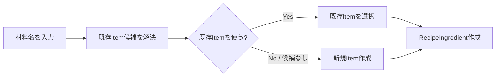
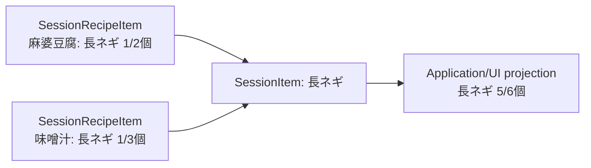
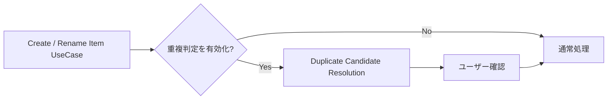

# Recipe-Deck MVP 仕様

このファイルは Recipe-Deck MVP の仕様の正本です。
設計・技術構成は [architecture.md](architecture.md) にあります。
Notion の要件ページや PoC ページと食い違う場合は、このファイルを優先します。
未確定事項は勝手に補完せず、実装時に相談します。
仕様に関わる変更をした PR では、このファイルも同じ PR で更新します。

> **過剰設計しないこと。**
> 将来起こり得る問題を先回りして、未要求の Entity・状態・Repository・履歴・分岐を追加しない。
> 将来の共有・同期・在庫・クラウド・undo などを理由に、不要な抽象化を追加しない。
> まず最小の自然なドメインを実装し、実際に必要になった責務だけ追加する。

## プロダクトの中核

Recipe-Deck は、単品の買い物 Item を直接並べることを主目的にせず、**「何を作るか／何のために買うか」を起点に買い物リストを作るアプリ**です。

代表フロー：

1. Recipe「麻婆豆腐」を登録する
2. Recipe に豆腐・長ネギ・ひき肉などを登録する
3. Recipe を今回の ShoppingSession へ追加する
4. 必要な Item を買い物リストとして表示する
5. 店頭で購入済みをチェックする

MVP ではユーザー所有の Recipe を前提とし、公開・共有・EC 連携などは対象外です。

## 用語

| 呼び方 | コード上の名前 | 意味 |
|---|---|---|
| Recipe | `Recipe` | ユーザーが再利用する「作るもの」 |
| 材料 | `RecipeIngredient` | Recipe で、ある Item をどれだけ使うか |
| Item | `Item` | 買い物対象の同一性（ひき肉、豆腐、長ネギ） |
| 分量 | `Amount` | 数量と、省略可能な単位の組 |
| 数量 | `Quantity` | 正の有理数 |
| 単位 | `AmountUnit` | 個・g・kg・ml・L |
| 倍率 | `Multiplier` | Recipe を Session へ追加するときの倍率 |
| 下書き／利用可能 | `RecipeStatus.DRAFT` / `READY` | Recipe の状態 |
| ShoppingSession | `ShoppingSession` | 「今回の買い物」 |
| 進行中／完了 | `SessionState.Active` / `Completed` | ShoppingSession の状態 |
| Session 内の Recipe | `SessionRecipe` | Session へ追加した Recipe のコピー |
| Session 内の材料 | `SessionRecipeItem` | Session 内の Recipe が、ある Item をどれだけ必要とするか |
| Session 内の Item | `SessionItem` | Session 内の Item 1つ（買い物リストの1行の元） |
| 手動追加 | `ManualAddition` | Recipe を経由せず Session に手で足した分 |
| 今回は不要 | `SessionRecipeItem.isExcluded` | Recipe 本体は変えずに、今回だけ材料を外すこと |

## Recipe

ユーザーが再利用する「作るもの」です。

確定事項：

- 名前のみ必須（空白だけの名前は不可）
- 写真は任意
- メモは任意（説明欄は持たない）
- 材料0件でも保存できる
- 人数は持たない
- 状態は下書き（draft）／利用可能（ready）。ユーザーが明示的に切り替え、材料数や写真の有無から自動判定しない
- Recipe に登録された材料構成を1単位として扱う
- 同じ Item を1つの Recipe に複数行持てる
- ShoppingSession へ追加するとき倍率を指定できる。倍率は正の有理数（1/4、1/2、1、2…）で、選択肢は UI が決める
- Recipe を編集しても、既に ShoppingSession へ追加済みの内容は自動で変えない

## Item

Recipe や ShoppingSession に所属しない、**買い物対象の同一性**を表す概念です。
例：ひき肉、豆腐、長ネギ。

確定事項：

- Item の同一性は内部 ID で表す
- 数量・単位・メモ・Recipe 内の並び順などは Item 本体に持たせない
- Recipe 由来か手動追加かで Item の種類を分けない
- Item の表示名変更（rename）と、異なる Item 同士の同一性統合（merge）は概念として別
- AI があってもなくても Item というドメイン概念は変えない
- Session で手動追加したものも Item として作る（Session 固有のデータは Session の外へ出さない）

## 分量

数量と単位の組です。
材料（RecipeIngredient）と Session 内の材料（SessionRecipeItem）が持ちます。

確定事項：

- 数量は正の有理数（分子・分母、約分済み）。0 と負の数は不可。1/3個のような量を正確に持ち、合算や倍率で誤差を出さないため、小数では持たない
- 数量の未指定は分量ごと省略して表す（0 として扱わない）
- 単位は 個・g・kg・ml・L と単位なし。玉・束・本など物そのものを数える数え方は「個」にまとめる。ユーザー定義の単位は作らない
- パック・袋など入れ物を数える単位の扱いは未確定（[未確定事項](#未確定事項)）
- 単位だけで数量が無い状態は作れない。単位だけ入力された場合は分量なしとして扱う（入力側の処理）
- 単位は入力されたまま保存し、換算しない（1000ml を勝手に 1L にしない）
- 入力の書き方（分数か小数か）は、量とは別の欄として残す。入力の UseCase を作るときに追加する

## ShoppingSession

「今回の買い物」を表す単位です。

確定事項：

- 履歴として複数保持できる
- 通常 UI では active な Session は最大1件
- 状態は active / completed の2つ。捨てる買い物リストは保存せず削除する
- completed な Session は過去の買い物として扱い、Session にコピーした内容（Recipe 名・倍率・分量など）をそのまま残す。Item は ItemId で参照するため、Item の表示名を固定するかは未確定（[未確定事項](#未確定事項)）
- 作成日時と完了日時を持つ。完了日時を持つのは completed の Session だけ。作成日時は Session を作った時点
- Recipe を Session へ追加した後、元 Recipe の編集で自動同期しない
- Session 内のデータは Session だけで完結させ、元 Recipe へ密結合させない
- Session の中だけで材料の追加・数量変更・「今回は不要」の除外ができ、Recipe には反映しない。除外した材料も Session に残り、再び有効にできる
- Session 内の Recipe に今回だけ追加した材料と、Recipe からコピーした材料は区別しない（どちらも Session 内の材料として持つ）。Recipe を経由せず Session に手で足した分は、手動追加として区別して持つ
- Session から Recipe 単位で削除できる。ただし買い物リストの表示の作り方次第で不要になりうる
- 追加後に倍率を変える操作は MVP に入れない
- 購入済みチェックはドメインに持たせない（[購入済みチェック](#購入済みチェック)）

## 材料の Item 参照

**保存済みの材料（RecipeIngredient）は Item を必ず参照する。**
「Item 未確定の材料」というドメイン状態は MVP では作らない。

未確定なのは、テキスト入力中や候補選択中の **UI / アプリケーション上の一時状態**であり、永続的なドメイン状態ではない。

## ShoppingSession への Recipe 追加

Recipe を Session へ追加するとき、Session 側へ必要な情報をコピーする。
**追加後は ShoppingSession 側で閉じる**。

- 元 Recipe を編集しても既存 Session は変わらない
- Recipe が後から削除・変更されても、進行中 Session の意味を壊さない
- Session へコピーするのは、Recipe 名・追加時の倍率・倍率をかけた後の分量
- Session 内の材料は倍率をかけた後の分量を持つ。Session 内で数量を直したときに、倍率をかける前の値か後の値かが曖昧にならないため
- 元 Recipe の ID は Recipe 画面へ移動するためだけに持ち、それ以外で Recipe を参照しない
- Session の編集を Recipe へ反映する機能を考えるときに、データ設計とあわせて見直す

## 買い物リスト表示

**統合済みの買い物項目を永続化せず、Session 内の Item などから表示のたびに集計する。**

例：

- 麻婆豆腐 → 長ネギ 1/2個
- 味噌汁 → 長ネギ 1/3個
- 同じ Item へ解決されていれば、表示上は長ネギ 5/6個

理由：

- 元のデータを正として扱える
- 二重管理を避けられる
- Item の統合や表示仕様の変更に追従しやすい
- MVP の規模では、表示のたびの集計で性能問題は起きにくい

数量の未指定を 0 として扱わない。
互換性のない単位を無理に1つの数量へ変換しない。
合算したときの単位の表し方（換算して自然な表現にするか、「1L + 1000ml」のように並べるか）は動かしながら決める。

## 購入済みチェック

要件：

- ShoppingSession 上の買い物項目を購入済み／未購入へ切り替えられる
- オフラインで利用できる
- アプリの再起動などで容易に失われない方がよい

**購入済みチェックはドメイン（Session のスナップショット）に持たせず、アプリケーション層の責務とする。**
スナップショットとは変わる頻度もライフサイクルも違うため、同じ場所に混ぜない。
保存方法は [architecture.md](architecture.md#未確定事項) の未確定事項として扱う。

## Item 重複判定と AI

**AI の採否はドメインモデルを変えない。**
AI / ML はドメインの中心に置かず、UseCase へ差し込める補助機能として扱う。
Item の新規作成や rename などの UseCase へ、既存 Item との重複候補判定を差し込むかどうかだけの問題として扱う。

実装は feature flag などで ON / OFF できる程度の疎結合を目標とする。

### silent merge は禁止

AI やルールが高確度と判断しても、**勝手に既存 Item へ merge しない**。
重複判定は次の用途にだけ使う。

- 候補の提示
- 候補の順位付け
- 明らかに別物の候補の抑制

既存 Item を選ぶか新規 Item を作るかは、最終的にユーザーの操作で決める。

## Alias と既知知識

Item の同一性には、複数の表記（surface）を関連付けられる余地を持つ。
例：玉ねぎ、玉葱。

ただし、alias の文字列から Item を常に1対1で決めてはいけない。
例：「さけ」は酒にも鮭にもなりうる。
そのため概念上は、正規化した表記から複数の Item 候補を引ける余地を残す。
候補が複数ある場合は「酒／鮭のどちらですか」のようにユーザーに選んでもらう。
既知の alias で解決できるケースが増えるほど、AI 推論を呼ぶ必要は減る。

Alias の具体的な Entity 構造、出典の種別、永続化形式はまだ決めない。
必要になった時点で最小の構造を設計する。

## SAME / NOT_SAME / AI 判定の整理

過去の PoC の SAME_HIGH_CONFIDENCE / UNKNOWN などは**実験上のラベル**であり、そのまま MVP のドメイン型に持ち込まない。
MVP で必要なのは、実用上は次の導線である。

- 既知の安全な候補
- 通常の類似候補
- 明示的に抑制すべき候補
- ユーザーが最終的に既存 Item を選ぶ／新規 Item を作る

「UNKNOWN」という永続ドメイン状態を新設しない。

## Rename と Merge

- Rename：同じ Item ID の表示名を変更する操作。rename 時にも通常の重複判定 UseCase を接続してよい
- Merge：異なる Item ID を同じ Item として扱う操作。rename 時に既存 Item との重複が見つかった場合、必要なら merge 処理へ接続できる

**AI の採否によって merge の設計を根本から変えない。**
AI が遅い／使わない場合は、その UseCase への重複判定の接続を無効にすればよい。

## 未確定事項

実装前に全部は確定させない。
実際に UseCase を1つずつ実装し、必要性が見えた時点で相談する。

- 合算したときの単位の表し方
- パック・袋など入れ物を数える単位の扱い。同じ Item で「1個」と「1パック」が混ざると、「個」にまとめた場合は誤って合算される。合算の表し方と一緒に決める
- 空の Session を有効な状態とするか
- MVP に merge を含めるか
- merge 後の旧 Item ID の扱い（redirect / tombstone、undo を含む）
- completed の Session で Item の表示名を固定するか（rename・merge の影響）。履歴の画面を作るときに決める

## 参照

背景資料です。
このファイルと食い違う場合は、このファイルを優先します。

- [買い物アプリ 要件定義（たたき台）](https://app.notion.com/p/3eb36b11d5ed81d39f61c48938e32b16)
- [MVP ドメイン・ユースケース設計（議論ログ）](https://app.notion.com/p/3ec36b11d5ed8153bad3f9972c835cee)
- [オンデバイス材料正規化 PoC](https://app.notion.com/p/3ec36b11d5ed81bc9e8afb2220965324)
- [Item 同一性判定 PoC](https://app.notion.com/p/3ec36b11d5ed8103880cc354f4217c14)
- [Safety-first Item 重複判定 PoC](https://app.notion.com/p/3ec36b11d5ed810c9934e5edceee4e21)
